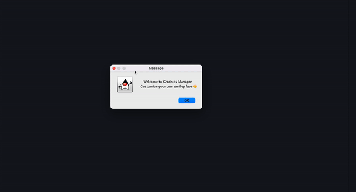

# Java Graphics Project

  This program generates a Smiley Face canvas. You will be able to either use default color or create your own color.

  

---

## Contents 🗒

1. [Project Preview](#project%20preview)
2. [Installation](#installation)
3. [Technologies](#technologies)
4. [License](#license)
5. [Contributing](#contributing)
6. [Authors and acknowledgment](#authors%20and%20acknowledgment)
7. [Contacts](#contacts)

## Project Preview 📸

---

## Installation 📀

  Clone repo, compile, run.

  To clone the repo:

    git clone 
    
    git@github.com:vynguyen205/Java-Graphics-Project.git

---

## Technologies 👩🏻‍🔧

- Java

---

## License 👮🏻‍♀️
  License used for this project - MIT
  * For more information on license types, please reference this website
  for additional licensing information - [https: //choosealicense.com/](https://choosealicense.com/).

---

## Contributing 💃🏻

To contribute to this application, create a pull request.
  Here are the steps needed for doing that:
  - Fork the repo
  - Create a feature branch (git checkout -b NAME-HERE)
  - Commit your new feature (git commit -m 'Add some feature')
  - Push your branch (git push)
  - Create a new Pull Request
  Following a code review, your feature will be merged.

---

## Links 🔗 

**[GitHub Link 🐱](https://github.com/vynguyen205/Java-Graphics-Project)**

---

## Usage Instructions 💻

Once you compile, just answer the prompt.

---

## Authors and Acknowledgments ✨

Built by Vy Nguyen

---

## Contacts ☎️

- GitHub Username: [vynguyen205](https://github.com/vynguyen205)
- GitHub Email: vynguyen0520@gmail.com
  
